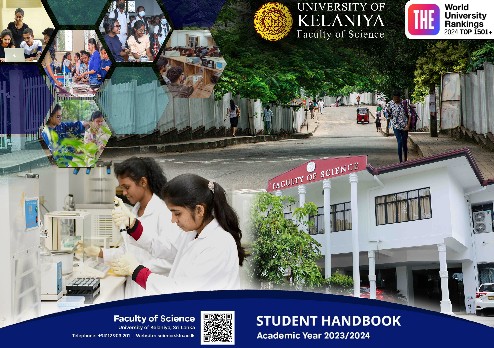

# 🎨 Photoshop Design Collection

## 🧰 Tools Used

* Adobe Photoshop

## 📌 Description

A collection of creative Photoshop designs including a university handbook cover, event poster, YouTube thumbnail, cinematic horror background, and product sticker design.

These designs were created for academic, creative, and concept-based projects.

---

## 🖼️ Designs

### 📘 University Handbook Cover Design

*(University of Kelaniya – Science Faculty Handbook)*

---

### ❤️ Valentine’s Day Poster Card

*(Romantic themed poster design)*

---

### 🎬 YouTube Thumbnail – "The Issima"

*(Trailer thumbnail for BlockNdino video)*

---

### 👻 Horror Film Background Design

*(Dark cinematic scary theme)*

---

### 🍝 Pasta Product Sticker Design

*(Food packaging sticker for pasta breakfast product)*

---

## 🚀 Purpose

This repository is part of my creative portfolio to showcase my graphic design skills and visual creativity using Adobe Photoshop.
